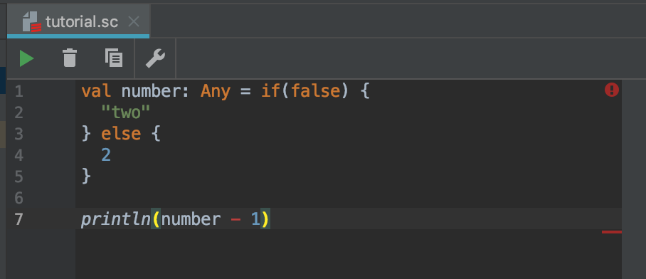

条件分岐はプログラミングの要です。  
このあたりから難しくなってきますが、  
**便利**かつ**楽しい**ものなので頑張っていきましょう。  

## if式
**if式**というものを使用していきます。  
**if式**を使用すると、
> もし◯◯ならAをする、  

といったプログラムを作る事ができます。
実際に使っていきましょう。  

if式はカッコに**Boolean**を渡して上げる必要があります。  
**Boolean**は前ページで紹介した、**true**か**false**のどちらかの値を持つ型です。  

if式は、trueを渡されると波括弧(`{}`)で囲まれたコードを実行します
falseを渡されると何も実行されません
```scala
// if式にtrueを渡す
if(true) {
    println("真")
}
> 真


// if式にfalseを渡す(何も出力されない)
if(false) {
    println("真")
}
```


### else式
else式を用いることで、
> もし◯◯ならAをする、  
◯◯でなければBをする。  

というプログラムを作ることができます。
試しに、年齢が18歳以上かどうかをチェックするプログラムを作ってみます。
```scala
// 20歳の場合
val age = 20

if(age > 18) {
    println("18歳以上です")
} else {
    println("18歳未満です")
}
> 18歳以上です
```

```scala
// 16歳の場合
val age = 16

if(age > 18) {
    println("18歳以上です")
} else {
    println("18歳未満です")
}
> 18歳未満です
```

## 代入
ifの`{}`に挟まれている、一番最後の値は変数に入れることができます。  
```scala
val age = 20
val message = if(age > 18) {
    "18歳以上です"
} else {
    "18歳未満です"
}

println(message)
> 18歳以上です
```
この処理ではage変数に20が入っているので、  
message変数に`"18歳以上です"`という文字列が入ります。  
めちゃくちゃ便利ですこれ

### Any型
Anyとは、日本語で**任意**や**なんでも**って意味です。  
```scala
val number: Any = if(false) {
    "two"
} else {
    2
}
```

こちらのコードはtrueの場合`"two"`、falseの場合`2`がnumber変数に入ります。  
この場合、String型かInt型どっちが入るかわからないので**Any型**になっちゃいます。  
Any型になるとString型やInt型で出来ることができなくなったり色々面倒なことになります。  
以下の画像のように、Int型で出来るはずの引き算をしようとするとエラーになったりします。  
**絶対にAny型にならないようにしてください。**   
Any型になってもこのエラーを回避する方法もありますが、  
**絶対にAny型にならないようにしてください。**

