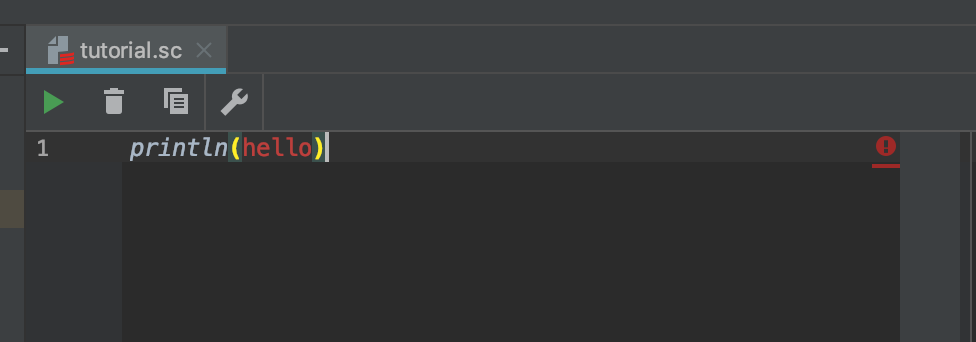

[前ページ](output.md)では文字の出力を行いました。  

## ダブルコーテーションの意味
以下のコードでhelloを`"`で囲う意味はあるのでしょうか？
```scala
println("hello")
> hello
```

試しに`"`を外してみます


**hello**の文字が真っ赤になりました。
これは`println`関数のように、`hello`という関数を使おうとしたが、見つからなかったということを表します。  

## 文字列(String型)
Scalaでは文字を表すために、`"`を使用します。  
`"`で囲われているものを**文字列**といいます。  

## 数値(Int型)
数値は1や2や3とかです。  
文字列が`"`で囲うのに対して、  数値は囲う必要がないです。  
これは、関数の頭文字に数値を使用できないという性質があるためです。  
なにはともあれ適当な数字を入れて実行してみましょう。  
```scala
println(123)
> 123
```
123が出力されました。

### 四則演算
四則演算とは、
足し算、  
引き算、  
掛け算、  
割り算です。  
実際にやってみましょう
```scala
// 足し算
println(6 + 3)
> 9

// 引き算
println(6 - 3)
> 3

// 掛け算
println(6 * 3)
> 18

// 割り算
println(6 / 3)
> 2

// 割り算(余り)
println(5 % 3)
> 2
```

### 優先順位
計算の優先順位は通常の計算と同じです。  
掛け算や割り算より、足し算引き算を優先したい場合はカッコを使いましょう。　　
```scala
println(2 * 4 - 2)
> 6

println(2 * (4 - 2))
> 4
```

## 浮動小数点数(Float型)
浮動小数点数とは小数のことです。  
実は数値同士の計算では小数を求める事ができません。

```scala
// 小数以下は切り捨てられる
println(1 / 2)
> 0

// Float型同士の計算
println(1.0 / 2.0)
> 0.5

// Int型とFloat型の計算でも小数を求められる
println(1 / 2.0)
> 0.5

// 型を指定してあげるとInt型の値を入れても自動的にFloat型になる
val a: Int = 1
val b: Float = 2

println(a / b)
> 0.5
```

!!! note "文字列の数字"
    数値であっても`"`で囲うことで文字列になってしまいます。  
    文字列は四則演算できませんので注意しましょう。  
    ```scala
    "100" // 文字列の100
    100 // 数値の100
    ```
