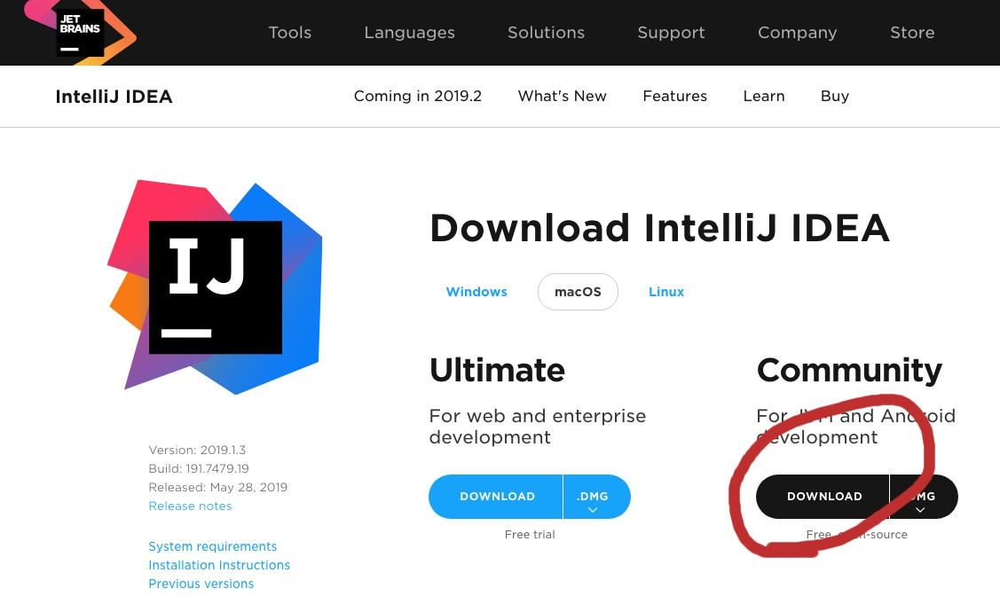
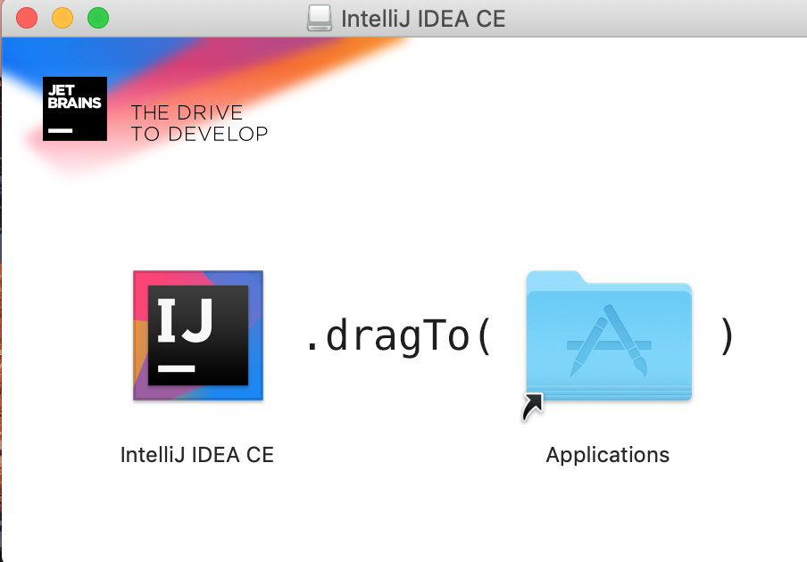
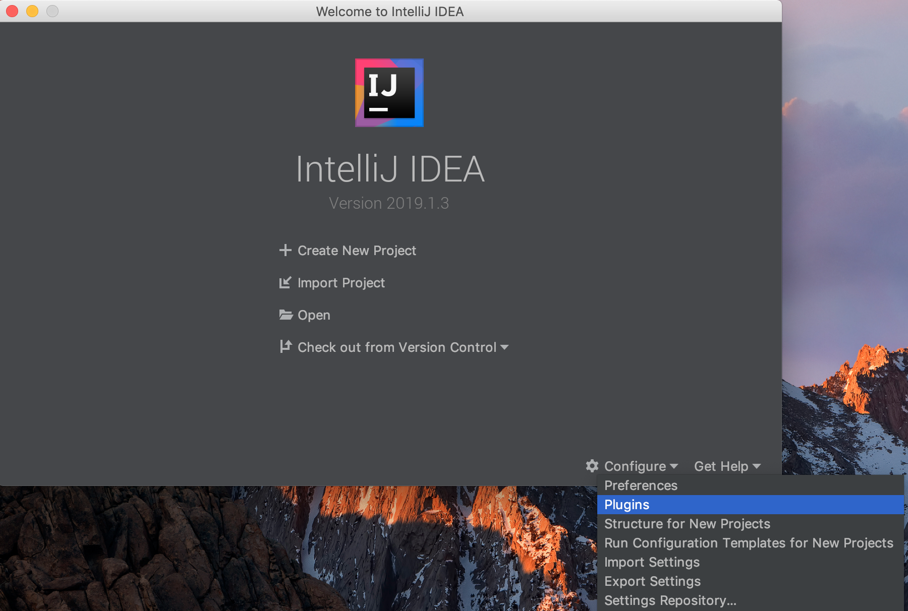
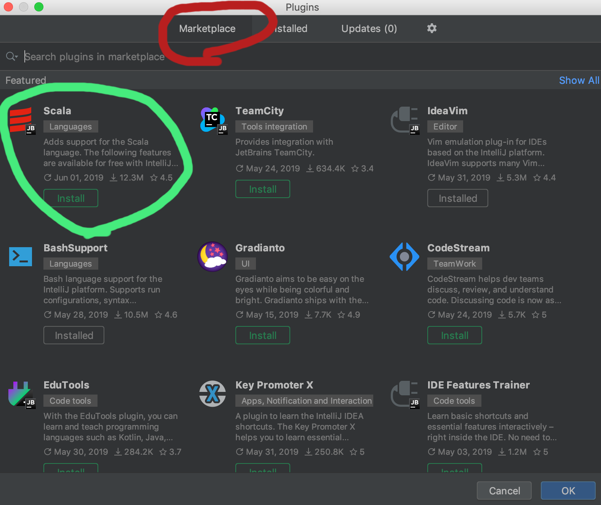

# IDE
IDEとは**統合開発環境**のことです。  
簡単に言うと、**プログラミングをするための便利機能がいっぱいついてるエディタ**です。  
Scalaエンジニアの大半はIntelliJ IDEAというIDEを使用しているので、本サイトでもこちらを使用します。  
IntelliJ IDEAにはUltimate Edition(有料)と、Community Edition(無料)がありますが、  
今回は無料であるCommuynity Editionを使用します。

## IntelliJ IDEAのインストール
[IntelliJ IDEA  ダウンロードページ](https://www.jetbrains.com/idea/download/)へアクセスしてください。
  
CommunityのほうのDOWNLOADボタンをクリックすると、  
ページが遷移しダウンロードが開始します。  

ダウンロード完了後、  
ダウンロードしてきた**idealC-バージョン.dmg**を実行し、  
指示の通りIntelliJ IDEA CEをApplicationsフォルダにドラッグドロップしてください。  

インストール完了後、IntelliJ IDEAを起動してください。  
起動時に出てくるポップアップはそのままOKで大丈夫です。

## Scalaプラグインのインストール
IntelliJ IDEAでScalaを使用するために、Scalaプラグインをインストールします。

IntelliJ IDEAを起動し、起動画面にたどり着いたら、  
右下にある**Configure**をクリックしてください。  
メニューが表示されるので、そのまま**Plugins**の項目をクリックしてください。

上にある**Marketplace**のタブを選択し、
緑の丸で囲われているScalaプラグインがあることを確認してください。  
無ければ検索機能で**Scala**で検索してください。  
Scalaプラグインについてある**install**ボタンをクリックしてください。

インストール完了後、installボタンが**Restart IDE**ボタンに変わっているので、ボタンをクリックしてください。  
クリックすると、IntelliJ IDEAが再起動し、Scalaプラグインが有効になります。
