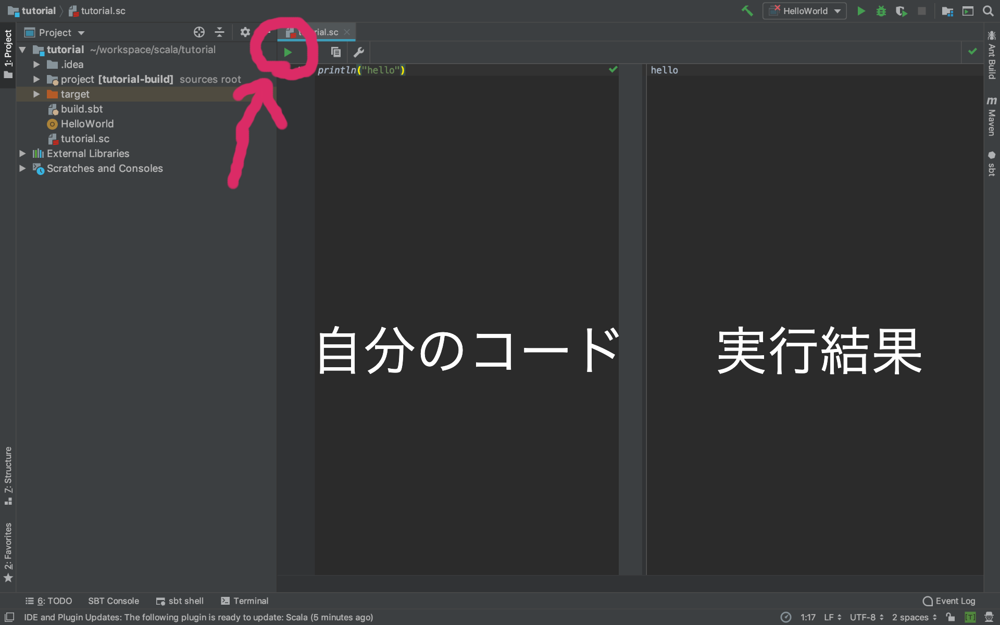

# Scalaワークシート
普通であれば拡張子`.scala`のファイルを使用するのですが、  
しばらくの間はScalaワークシートという拡張子`.sc`のファイルを使用します。  

Scalaワークシートは簡単にScalaを実行できる、練習やテストなどに適しているものです。  
プロジェクト内ならどこに作成してもいいですが、今回はtutorial直下に作成しましょう。  
ファイル名もなんでもいいですが。今回は`tutorial.sc`とします。

作成された後のフォルダ構成は以下の通りです。
```
tutorial/
┣ .idea/
┣ project/
┣ target/
┣ HelloWorld.scala
┣ build.sbt
┗ tutorial.sc
```


早速`tutorial.sc`にScalaを書き込み、実行してみましょう。  
コードの解説などは次ページ以降に行います。  
```scala
println("hello")
```

赤で囲っている再生マークをクリックすると、実行されます。  
実行すると右に結果が表示されます。



環境構築はこれにて終了です。  
お疲れ様でした。


また、次ページ以降では、
以下のような形でコードの解説をします。
```
自分のコード
> 実行結果
```

実際にコードを入れると以下のような感じです
```scala
println("hello")
> hello
```
